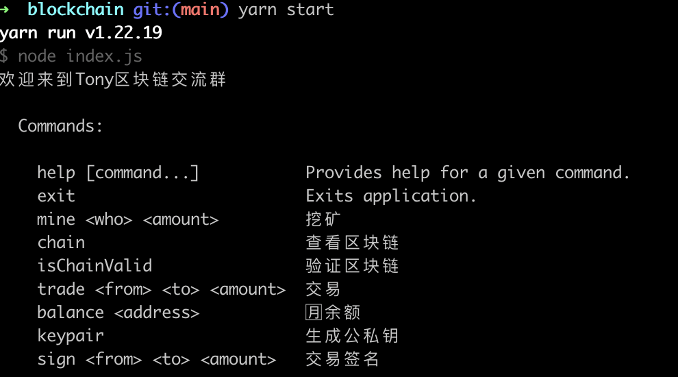

## tBlockchain

一个使用javascript实现的区块链底层运行原理，包括
- P2P网络（Peer To Peer）UDP
- 区块链数据结构hash链表
- 单一区块合法性验证
- 整条链的合法性验证
- 交易数据结构(Merkle Tree)
- block的header和body存储内容
- 挖矿原理实现
- pow共识机制

其中用到的工具和类库包括：


- [加密算法库cryptoJS](https://github.com/brix/crypto-js)
- [椭圆曲线加密elliptic](https://github.com/indutny/elliptic)
- [UUID](https://github.com/uuidjs/uuid)
- [Node CLI 应用程序的框架](https://github.com/dthree/vorpal)
  
## 构建源代码

```javascript
yarn start
```

